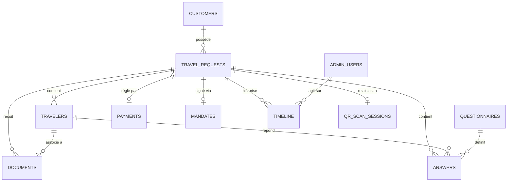
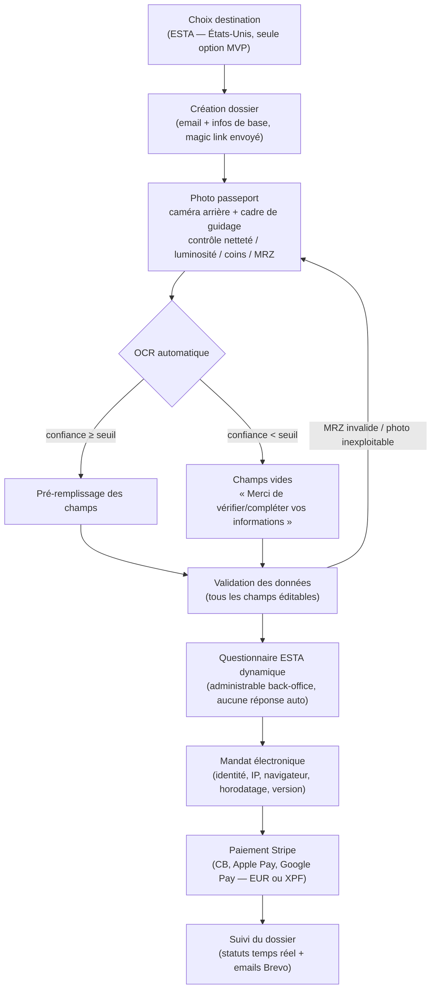
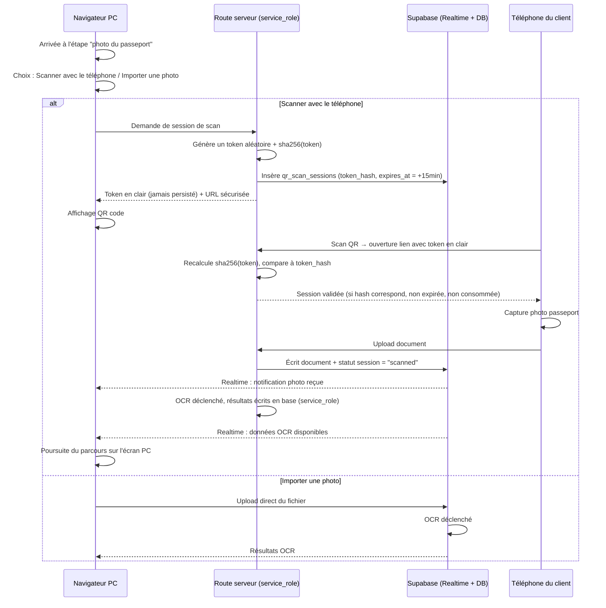
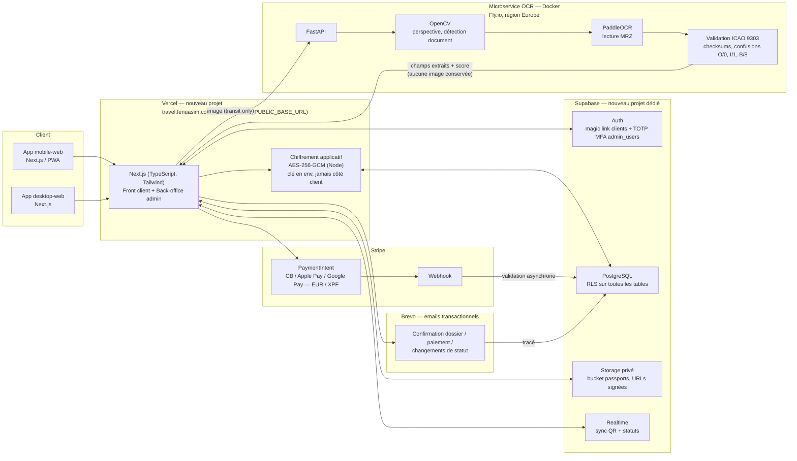
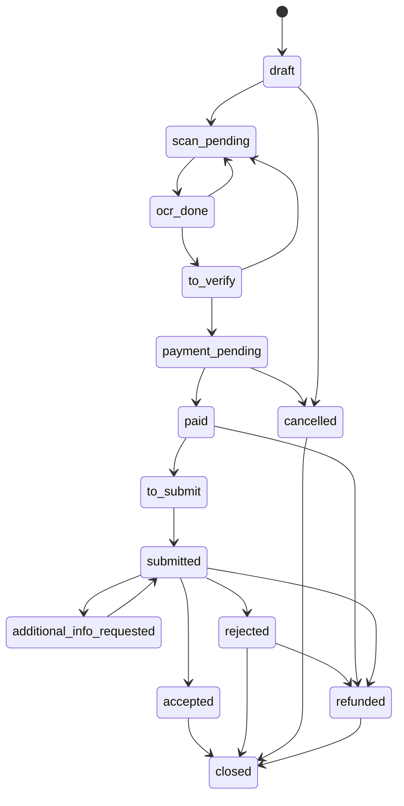

# FenuaSIM Travel — MVP ESTA — Étape 0 (validation — révision 2)

Document de cadrage avant toute implémentation. Rien n'est codé tant que cette révision
n'est pas validée. Changements depuis la révision 1 : cf. section 8 "Décisions validées"
et le détail des corrections de sécurité/planification ci-dessous.

Schéma SQL complet : [`db/schema.sql`](../db/schema.sql).

## 1. Schéma de base de données

10 tables minimum demandées + 2 tables complémentaires nécessaires au parcours décrit
(`qr_scan_sessions` pour le relais desktop → mobile, `app_settings` pour les valeurs
configurables : prix, seuil OCR, durées de rétention, taux de change).

Changements de sécurité intégrés dans le schéma (détaillés en commentaires dans le fichier SQL) :

- **`qr_scan_sessions.token_hash`** remplace `token` : seul le hash SHA-256 du token est stocké,
  jamais le token en clair. Le token en clair n'existe que dans le QR code / lien transmis
  au client et n'est jamais persisté. Vérification par comparaison de hash, côté serveur uniquement.
- **`travelers.passport_number_encrypted` / `mrz_encrypted`** : chiffrés côté application
  (Node, AES-256-GCM) avant l'insert — la base ne reçoit jamais de valeur en clair, ce qui
  élimine tout risque de fuite via les logs Postgres (requêtes, `pg_stat_statements`, etc.).
  Colonne `encryption_key_version` ajoutée pour permettre une rotation de clé versionnée.
- **`payments`** : double ligne de facturation (`service_fee_amount` / `official_fee_amount`),
  devise choisie par le client (`currency` : `eur` ou `xpf`), traçabilité des taux de change
  utilisés (`fx_rate_eur_xpf`, `fx_rate_usd_eur`).
- **`timeline`** : rendue strictement append-only (plus de `updated_at`/`deleted_at`),
  `UPDATE`/`DELETE` révoqués explicitement pour tous les rôles, y compris `service_role`.
- **Policies RLS écrites pour toutes les tables** (cf. section 2 ci-dessous pour le mécanisme
  dont elles découlent).

## 2. Mécanisme d'authentification client (nouveau)

**Supabase Auth magic link (OTP par email), aucun mot de passe.**

1. À la création du dossier, le client saisit son email.
2. Supabase envoie un lien magique / code OTP à cet email.
3. À la première validation, une ligne `auth.users` est créée par Supabase ; la ligne
   `customers` correspondante est créée (ou liée si l'email existait déjà) avec
   `auth_user_id` renseigné.
4. Toute reprise ultérieure du dossier (brouillon abandonné, suivi de statut) se fait par
   le même mécanisme : email → lien magique → session Supabase → accès aux dossiers liés
   à `customer_id`.

**Toutes les policies RLS découlent de ce lien** `customers.auth_user_id = auth.uid()` :
une fonction `auth_customer_id()` (security definer) retourne l'identifiant `customers.id`
du client courant, et une fonction `owns_travel_request(id)` vérifie qu'un dossier lui
appartient. Les tables dépendantes (`travelers`, `documents`, `answers`, `payments`,
`mandates`, `timeline`) appliquent leurs policies via ce même point d'entrée. Le staff
back-office (`admin_users`) dispose d'un accès élargi via une fonction `is_staff()` /
`is_admin_or_above()` / `is_superadmin()` selon le rôle.

Deux tables font exception et n'ont **aucune policy pour le rôle `authenticated`** :
`qr_scan_sessions` (accès exclusivement via route serveur + `service_role`, cf. section 1)
et `app_settings` en lecture publique (le front lit les valeurs nécessaires via une route
serveur, jamais par requête directe — cf. section 9).

## 3. Parcours utilisateur

### 3.1 Mobile

### 3.2 Desktop (avec relais mobile)

## 4. Architecture technique

## 5. Statuts du dossier (MVP)

| # | Statut (code) | Libellé client | Déclencheur |
|---|---|---|---|
| 1 | `draft` | Brouillon | Création du dossier |
| 2 | `scan_pending` | Scan en attente | Client arrivé à l'étape photo, pas encore uploadée |
| 3 | `ocr_done` | OCR terminé | Traitement OCR terminé (succès ou fallback) |
| 4 | `to_verify` | À vérifier | Client sur l'écran de validation des données |
| 5 | `payment_pending` | Paiement en attente | Mandat signé, redirection Stripe |
| 6 | `paid` | Payé | Webhook Stripe confirmé |
| 7 | `to_submit` | À déposer | Payé, en attente de dépôt manuel opérateur |
| 8 | `submitted` | Déposé | Opérateur a déposé la demande sur le site gouvernemental |
| 9 | `additional_info_requested` | Complément demandé | Retour des autorités nécessitant une action client |
| 10 | `accepted` | Accepté | Autorisation ESTA délivrée |
| 11 | `rejected` | Refusé | Autorisation ESTA refusée |
| 12 | `cancelled` | Annulé | Annulation (client ou opérateur) |
| 13 | `refunded` | Remboursé | Remboursement déclenché en back-office |
| 14 | `closed` | Clôturé | Dossier archivé (terminal) |

Transitions ajoutées en révision 2 : `ocr_done → scan_pending` et `to_verify → scan_pending`
(re-scan si MRZ invalide ou photo inexploitable), `rejected → refunded` (remboursement
possible après un refus ESTA).

## 6. Plan de sprints (MVP ESTA seul, révisé)

Principe directeur (révision 2) : **la sécurité se construit au fil de l'eau**, pas au
Sprint 6. Chaque table reçoit ses policies RLS dès le sprint où elle entre en usage ; le
chiffrement passeport est en place dès les premières données stockées (Sprint 2). Le
Sprint 6 devient une **revue de sécurité complète**, plus une phase d'implémentation initiale.

| Sprint | Durée | Contenu |
|---|---|---|
| 0 | 3-4 jours | Setup repos, projet Vercel, projet Supabase dédié, schéma DB appliqué avec policies RLS de base (`customers`, `admin_users`), design system dupliqué, variables d'environnement, génération de la clé de chiffrement (`PASSPORT_ENCRYPTION_KEY_V1`) et documentation de la procédure de rotation |
| 1 | 1 semaine | Auth magic link (Supabase OTP), création dossier (`travel_requests`) + policies associées, timeline de base (append-only) + revoke UPDATE/DELETE, back-office : auth admin (staff + TOTP MFA) + dashboard liste dossiers |
| 2 | 1-1.5 semaine | **Ordre de livraison : (1) fallback saisie manuelle d'abord** — parcours complet testable sans dépendre de l'OCR — **(2)** upload Storage privé + policies `documents`, **(3)** chiffrement AES-256-GCM appliqué dès l'écriture des premières données passeport (`travelers`), **(4)** déploiement microservice OCR (Fly.io), parsing MRZ + checksums ICAO, **(5)** flux QR desktop→mobile avec token hashé (SHA-256), vérification exclusivement via route serveur |
| 3 | 1 semaine | Écran de validation/édition des champs, questionnaire dynamique + policies `questionnaires`/`answers`, back-office : configuration questionnaire + visualisation réponses |
| 4 | 1 semaine | Mandat électronique + policy `mandates` (insert client, immuable), intégration Stripe EUR/XPF avec double ligne (frais de service / frais officiels), webhook + idempotence + policy `payments` (lecture client, écriture service_role uniquement), **emails transactionnels Brevo** (création dossier, paiement confirmé, chaque changement de statut visible client) tracés dans `timeline` via l'event_type `email_sent`, back-office : remboursement manuel |
| 5 | 1 semaine | Back-office complet : filtres/recherche, changement de statut + notes internes (via `timeline`), vue passeport + correction opérateur, suivi client temps réel, policies `admin_users` (self + superadmin), `app_settings` (lecture staff, écriture admin+) |
| 6 | 1 semaine | **Revue de sécurité complète** (pas d'implémentation initiale) : audit de toutes les policies RLS, vérification des URLs signées Storage, test de la purge automatique (documents + brouillons abandonnés), vérification de l'absence de données sensibles dans les logs, validation MIME stricte, revue de la procédure de rotation de clé |
| 7 | 3-5 jours | Tests end-to-end (mobile + desktop), recette fonctionnelle, corrections, mise en production |

**Total estimé : ~7-8 semaines** pour une équipe de 1-2 développeurs.

## 7. Analyse des risques

| Risque | Impact | Mitigation |
|---|---|---|
| Fiabilité OCR (MRZ mal lu, photo dégradée) | Données pré-remplies erronées acceptées par erreur | Seuil de confiance ajustable (défaut 0.85), tous les champs restent éditables et doivent être validés par le client, checksums ICAO stricts, re-scan possible (`to_verify → scan_pending`), double vérification opérateur avant dépôt |
| Webhook Stripe manqué ou rejoué | Dossier marqué payé sans paiement réel, ou paiement réel non reflété | Validation du statut uniquement via webhook signé, jamais côté client ; idempotency_key unique en base ; traitement idempotent par `stripe_payment_intent_id` |
| Sécurité de l'upload passeport | Fuite de données d'identité sensibles | Bucket Storage privé, URLs signées temporaires uniquement, validation MIME stricte, chiffrement applicatif AES-256-GCM du numéro de passeport et de la MRZ (jamais en clair côté base), purge automatique après durée configurable |
| Fuite ou compromission de la clé de chiffrement | Exposition potentielle des passeports historiques | Clé jamais commitée, uniquement en variable d'environnement serveur (jamais `NEXT_PUBLIC_`), accès restreint aux seules fonctions serveur qui en ont besoin, procédure de rotation versionnée (`encryption_key_version`) |
| Détournement de session QR (desktop → mobile) | Un tiers accède à la session de scan d'un autre client | Token haute entropie, jamais stocké en clair (seul son hash SHA-256 l'est), à usage unique, expiration 15 min, lié à un `travel_request_id` précis, aucun accès table direct côté client (route serveur uniquement) |
| Non-respect des durées de rétention (RGPD) | Non-conformité, données conservées trop longtemps | Job planifié de purge basé sur `scheduled_deletion_at` et `app_settings`, soft delete puis suppression effective du fichier Storage |
| Disponibilité du microservice OCR (hors Vercel) | Parcours mobile bloqué si le service ne répond pas | Timeout court + fallback automatique vers saisie manuelle (livré en premier au Sprint 2), monitoring/alerting sur le service, health checks natifs Fly.io |
| Compromission d'un compte admin | Accès à des données passeport de nombreux clients | RLS stricte sur les tables sensibles, rôle applicatif limité (`admin_role`), **MFA TOTP obligatoire dès le MVP**, toute action admin tracée dans `timeline` |
| Erreur de conversion de devise (EUR / XPF / USD) | Montant facturé incorrect, litige client | Parité EUR↔XPF fixe et non recalculée (119,3317, tracée par paiement), taux USD→EUR tracé à chaque transaction pour audit, double ligne affichée clairement avant paiement, montant confirmé par Stripe jamais recalculé après coup |

### Hébergement du microservice OCR

**Fly.io, région Europe** — confirmé (~5-10 $/mois pour la charge MVP, Docker natif, scale-to-zero possible en pré-lancement).

## 8. Décisions validées (retour de validation)

- **Prix : 30 € de frais de service FENUASIM** par dossier (`esta_price_cents = 3000`).
  Les frais officiels ESTA (40 USD) sont refacturés en sus, affichés sur une ligne séparée :
  *« Frais de service FENUASIM : 30 € »* + *« Frais officiels du gouvernement américain :
  40 USD (montant converti affiché) »*. Le schéma `payments` trace les deux montants distinctement.
- **Devises : EUR et XPF**, au choix du client. XPF est une devise zero-decimal chez Stripe
  (montants en unités entières, pas de centimes) — documenté dans le schéma. Parité fixe
  EUR→XPF : **119,3317**, tracée par paiement (`fx_rate_eur_xpf`), pas de taux de marché.
- **MFA admin : V1**, via TOTP natif Supabase Auth.
- **Hébergeur OCR : Fly.io**, région Europe.
- **Seuil OCR : 0,85** au départ (configurable via `app_settings`).
- **Rétention : 30 jours** pour les photos de passeport, **30 jours** pour les brouillons abandonnés.
- **Sous-domaine : `travel.fenuasim.com`** (variable d'environnement déjà prévue).
- **Mécanisme d'accès client : Supabase Auth magic link (OTP email)**, sans mot de passe (cf. section 2).
- **Token QR : hashé (SHA-256)**, jamais stocké en clair (cf. section 1).
- **Chiffrement passeport/MRZ : côté application (AES-256-GCM)**, jamais en SQL (cf. section 1).
- **`timeline` : append-only strict**, `UPDATE`/`DELETE` révoqués pour tous les rôles.
- **`app_settings` : aucune lecture directe côté client** — le front passe par une route serveur.
- **Taux USD → EUR : saisie manuelle périodique par un opérateur**, pas d'API de taux de
  change au MVP. Modifiable en back-office comme les autres `app_settings`, traçabilité
  via `updated_by`. Valeur initiale : **0,95** (léger buffer au-dessus du marché pour
  absorber les frais de change bancaires réels — à recaler après le premier dépôt réel).
  Le tunnel client affiche le montant EUR/XPF converti final, avec la mention
  *« Frais officiels du gouvernement américain : 40 USD »*.

## 9. Points à valider

Plus aucun point bloquant. Le texte exact de la mention de non-affiliation gouvernementale
reste à fournir (emplacement UI déjà prévu) mais ne bloque pas le démarrage du Sprint 0 —
un texte provisoire sera utilisé en attendant.

**Validation finale accordée — Sprint 0 démarré.**
